# PHASE 3.7.6: EXISTING DATASET REFINEMENT & AUGMENTATION
**GAN Model Refinement with Real-World Data**  
**Duration:** 2-3 weeks  
**Goal:** Enable TVAE refinement using existing machine datasets to improve synthetic data quality  
**Status:** 🟢 READY TO START (December 8, 2025)

---

## Overview

**Problem Statement:**  
Currently, the GAN workflow generates synthetic data from scratch using physics-based seed data (10,000 samples). However, many machines already have **real historical datasets** from sensors/SCADA systems that can be used to:
1. **Refine existing TVAE models** (transfer learning approach)
2. **Augment small datasets** (when you have 500 samples, generate 35,000)
3. **Improve data quality** (learn from real sensor correlations instead of physics approximations)
4. **Validate TVAE fidelity** (compare synthetic vs real distributions)

**What Phase 3.7.6 Does:**
- Ingest existing datasets in any format (CSV, Excel, Parquet, JSON, SCADA exports)
- Validate and clean real-world data (handle missing values, outliers, incorrect timestamps)
- Map existing columns to machine profile sensors
- Refine existing TVAE models using real data (transfer learning)
- Augment small datasets to required sizes (35K/7.5K/7.5K)
- Compare refined synthetic data vs original synthetic data quality
- Provide dashboard UI for dataset upload, mapping, and refinement workflow

**Use Cases:**
1. **Scenario 1 - Small Dataset Augmentation:**  
   You have 500 real samples from a motor → Upload → Refine TVAE → Generate 35,000 synthetic samples
   
2. **Scenario 2 - Model Refinement:**  
   You have 10,000 real samples from a CNC machine → Refine existing TVAE model → Improve synthetic data quality
   
3. **Scenario 3 - New Machine with Existing Data:**  
   You have 5,000 samples from a new chiller → Skip seed generation → Train TVAE directly on real data
   
4. **Scenario 4 - Hybrid Approach:**  
   Combine 10,000 physics-based seed + 2,000 real samples → Train on merged dataset → Best of both worlds

---

## Architecture

```mermaid
graph TB
    subgraph "Data Ingestion Layer"
        Upload[📤 File Upload<br/>CSV/Excel/Parquet/JSON]
        Parse[🔍 Format Auto-Detection]
        Validate[✅ Data Validation<br/>Missing values, outliers, types]
    end
    
    subgraph "Data Mapping Layer"
        Map[🗺️ Column Mapper<br/>Map columns → sensors]
        Transform[🔄 Data Transformer<br/>Normalization, scaling]
        Merge[➕ Dataset Merger<br/>Combine seed + real data]
    end
    
    subgraph "Refinement Layer"
        Refine[🧠 TVAE Refinement<br/>Transfer learning]
        Augment[📊 Data Augmentation<br/>Generate more samples]
        Compare[📈 Quality Comparison<br/>Real vs Synthetic]
    end
    
    subgraph "Storage Layer"
        Raw[(📁 Raw Data)]
        Processed[(📁 Processed Data)]
        Refined[(📁 Refined Models)]
    end
    
    Upload --> Parse --> Validate
    Validate --> Map --> Transform --> Merge
    Merge --> Refine --> Augment --> Compare
    
    Validate --> Raw
    Transform --> Processed
    Refine --> Refined
```



---

## Project Structure

**New Root Directory:**
```
data_ingestion/
├── raw/                                # Original uploaded files (unmodified)
│   ├── motor_siemens_001/
│   │   ├── scada_export_2024.csv       # Original upload
│   │   ├── maintenance_logs.xlsx
│   │   └── upload_metadata.json        # Upload timestamp, user, format
│   └── cnc_brother_001/
│       └── sensor_data_2023-2024.parquet
│
├── processed/                          # Cleaned and transformed data
│   ├── motor_siemens_001/
│   │   ├── mapped_data.parquet         # Columns mapped to sensors
│   │   ├── cleaned_data.parquet        # Missing values handled
│   │   └── validation_report.json      # Data quality metrics
│   └── cnc_brother_001/
│       └── processed_data.parquet
│
├── merged/                             # Seed data + Real data combined
│   ├── motor_siemens_001/
│   │   ├── seed_10000.parquet          # Original seed data
│   │   ├── real_5000.parquet           # Real data (after processing)
│   │   └── merged_15000.parquet        # Combined dataset
│   └── cnc_brother_001/
│       └── merged_data.parquet
│
├── refined_models/                     # TVAE models refined on real data
│   ├── motor_siemens_001/
│   │   ├── original_tvae.pkl           # Original model (seed-trained)
│   │   ├── refined_tvae.pkl            # Refined model (real-data trained)
│   │   ├── training_comparison.json    # Loss curves comparison
│   │   └── refinement_config.json      # Epochs, learning rate used
│   └── cnc_brother_001/
│       └── refined_tvae.pkl
│
├── reports/                            # Quality comparison reports
│   ├── motor_siemens_001_comparison.json
│   ├── motor_siemens_001_comparison.pdf
│   └── all_machines_summary.csv
│
└── scripts/                            # Ingestion and refinement scripts
    ├── ingest_dataset.py               # Main ingestion script
    ├── validate_existing_data.py       # Data validation
    ├── map_columns.py                  # Interactive column mapping
    ├── refine_tvae.py                  # Transfer learning script
    ├── compare_distributions.py        # Statistical comparison
    └── utils/
        ├── format_parsers.py           # CSV/Excel/Parquet parsers
        ├── data_cleaners.py            # Missing value imputation
        └── mappers.py                  # Column mapping logic
```

---

## PHASE 3.7.6.1: DATA INGESTION INFRASTRUCTURE
**Duration:** Week 1 (Days 1-5)  
**Goal:** Build robust data ingestion pipeline supporting multiple formats

### Phase 3.7.6.1.1: Format Parsers & Validators (Days 1-2)

**Tasks:**
- [ ] Create `data_ingestion/scripts/utils/format_parsers.py`
- [ ] Implement parsers for 5 formats: CSV, Excel (.xlsx, .xls), Parquet, JSON, SCADA-specific
- [ ] Add auto-format detection based on file extension and content
- [ ] Implement validation: file size limits (max 500MB), row count limits (max 10M rows)
- [ ] Add error handling for corrupted files

**Supported Formats:**

| Format | Parser | Max Size | Features |
|--------|--------|----------|----------|
| CSV | pandas.read_csv | 500MB | Auto-delimiter detection, encoding detection |
| Excel | pandas.read_excel | 200MB | Multi-sheet support, date parsing |
| Parquet | pandas.read_parquet | 1GB | Efficient for large datasets |
| JSON | pandas.read_json | 100MB | Nested structure flattening |
| SCADA | Custom parser | 500MB | OPC UA, Modbus formats |

**File:** `data_ingestion/scripts/utils/format_parsers.py` (300+ lines)

**Key Functions:**
```python
def auto_detect_format(file_path: str) -> str:
    """Auto-detect file format based on extension and content"""
    
def parse_csv(file_path: str, **kwargs) -> pd.DataFrame:
    """Parse CSV with auto-delimiter and encoding detection"""
    
def parse_excel(file_path: str, sheet_name: str = None) -> pd.DataFrame:
    """Parse Excel with multi-sheet support"""
    
def parse_parquet(file_path: str) -> pd.DataFrame:
    """Parse Parquet files efficiently"""
    
def parse_json(file_path: str) -> pd.DataFrame:
    """Parse JSON with nested structure flattening"""
    
def validate_file_size(file_path: str, max_size_mb: int = 500) -> bool:
    """Check file size before parsing"""
```

**Expected Output:**
- ✅ All 5 formats parsed successfully
- ✅ Auto-detection accuracy > 99%
- ✅ Error messages for unsupported formats
- ✅ File size validation working

---

### Phase 3.7.6.1.2: Data Validation & Cleaning (Days 3-4)

**Tasks:**
- [ ] Create `data_ingestion/scripts/utils/data_cleaners.py`
- [ ] Implement validation checks: missing values, duplicate rows, outlier detection
- [ ] Add data type inference and conversion
- [ ] Implement cleaning strategies: forward-fill, backward-fill, interpolation, drop
- [ ] Add timestamp validation and sorting
- [ ] Generate validation reports (JSON + human-readable)

**Validation Checks:**

| Check | Purpose | Action |
|-------|---------|--------|
| Missing Values | Detect columns with >30% missing | Flag for user review |
| Duplicate Rows | Find exact duplicates | Auto-remove or flag |
| Outliers | IQR method, Z-score | Flag or clip |
| Data Types | Ensure numeric columns | Convert or flag errors |
| Timestamp Format | Validate datetime columns | Parse or reject |
| Column Count | Match sensor count | Flag mismatch |
| Row Count | Minimum 100 rows | Reject if too small |

**File:** `data_ingestion/scripts/utils/data_cleaners.py` (400+ lines)

**Key Functions:**
```python
def validate_dataset(df: pd.DataFrame, machine_id: str) -> ValidationReport:
    """Comprehensive dataset validation"""
    
def detect_missing_values(df: pd.DataFrame) -> Dict[str, float]:
    """Return % missing per column"""
    
def detect_outliers(df: pd.DataFrame, method: str = 'iqr') -> pd.DataFrame:
    """Flag outlier rows using IQR or Z-score"""
    
def clean_missing_values(df: pd.DataFrame, strategy: str = 'interpolate') -> pd.DataFrame:
    """Handle missing values: ffill, bfill, interpolate, drop"""
    
def validate_timestamps(df: pd.DataFrame, timestamp_col: str) -> bool:
    """Ensure timestamps are sorted and valid"""
    
def infer_data_types(df: pd.DataFrame) -> Dict[str, str]:
    """Auto-detect data types per column"""
```

**ValidationReport Schema:**
```json
{
    "machine_id": "motor_siemens_001",
    "file_name": "scada_export_2024.csv",
    "total_rows": 50000,
    "total_columns": 15,
    "missing_values": {
        "temperature": 2.5,
        "vibration": 0.1
    },
    "duplicate_rows": 120,
    "outliers": {
        "temperature": 45,
        "current": 23
    },
    "timestamp_sorted": true,
    "data_types": {
        "temperature": "float64",
        "timestamp": "datetime64"
    },
    "validation_passed": false,
    "errors": [
        "Column 'pressure' has 45% missing values",
        "120 duplicate rows detected"
    ],
    "warnings": [
        "45 outliers detected in 'temperature'"
    ]
}
```

**Expected Output:**
- ✅ Validation reports generated for all datasets
- ✅ Missing values detected accurately
- ✅ Outliers flagged with configurable threshold
- ✅ Cleaning strategies applied successfully

---

### Phase 3.7.6.1.3: Backend API for Ingestion (Day 5)

**Tasks:**
- [ ] Create `frontend/server/api/routes/data_ingestion.py`
- [ ] Implement 8 API endpoints for ingestion workflow
- [ ] Add Pydantic models for requests/responses
- [ ] Integrate with format parsers and validators
- [ ] Add file upload handling (multipart/form-data)

**API Endpoints:**

| Endpoint | Method | Purpose |
|----------|--------|---------|
| `/api/ingestion/upload` | POST | Upload existing dataset file |
| `/api/ingestion/{id}/validate` | POST | Validate uploaded dataset |
| `/api/ingestion/{id}/preview` | GET | Preview first 100 rows |
| `/api/ingestion/{id}/columns` | GET | Get all column names for mapping |
| `/api/ingestion/{id}/map` | POST | Map columns to sensors |
| `/api/ingestion/{id}/clean` | POST | Apply cleaning strategies |
| `/api/ingestion/{id}/merge` | POST | Merge with seed data |
| `/api/ingestion/datasets` | GET | List all uploaded datasets |

**Pydantic Models:**

**File:** `frontend/server/api/models/ingestion.py` (200+ lines)

**DatasetUploadResponse:**
```python
class DatasetUploadResponse(BaseModel):
    dataset_id: str  # UUID
    machine_id: str
    original_filename: str
    file_format: str  # csv|excel|parquet|json
    file_size_mb: float
    upload_timestamp: datetime
    total_rows: int
    total_columns: int
    preview_data: List[Dict[str, Any]]  # First 10 rows
    next_step: str  # "validate"
```

**DatasetValidationRequest:**
```python
class DatasetValidationRequest(BaseModel):
    dataset_id: str
    timestamp_column: Optional[str]  # User specifies which column is timestamp
    rul_column: Optional[str]  # User specifies RUL column (if exists)
```

**DatasetValidationResponse:**
```python
class DatasetValidationResponse(BaseModel):
    dataset_id: str
    validation_passed: bool
    validation_report: ValidationReport
    suggested_cleaning: Dict[str, str]  # Column → Strategy
    next_step: str  # "map_columns" or "fix_errors"
```

**ColumnMappingRequest:**
```python
class ColumnMappingRequest(BaseModel):
    dataset_id: str
    mappings: Dict[str, str]  # {"temperature_sensor_1": "bearing_de_temp_C"}
    unmapped_columns: List[str]  # Columns to drop
```

**File:** `frontend/server/api/routes/data_ingestion.py` (500+ lines)

**Expected Output:**
- ✅ All 8 endpoints functional
- ✅ File upload handles large files (streaming)
- ✅ Validation report returned with suggestions
- ✅ Column mapping saves to database

---

## PHASE 3.7.6.2: COLUMN MAPPING & TRANSFORMATION
**Duration:** Week 2 (Days 6-8)  
**Goal:** Enable users to map existing column names to machine profile sensors

### Phase 3.7.6.2.1: Interactive Column Mapper (Days 6-7)

**Problem:**  
Existing datasets have arbitrary column names (e.g., "Temp_Bearing_DE", "BRG_TEMP_1") that need to be mapped to machine profile sensor names (e.g., "bearing_de_temp_C").

**Tasks:**
- [ ] Create `data_ingestion/scripts/utils/mappers.py`
- [ ] Implement fuzzy matching algorithm (suggest mappings based on similarity)
- [ ] Add manual mapping interface (CLI and API)
- [ ] Validate mappings (ensure all required sensors are mapped)
- [ ] Handle extra columns (user can drop or keep as auxiliary data)

**File:** `data_ingestion/scripts/utils/mappers.py` (300+ lines)

**Key Functions:**
```python
def suggest_mappings(df_columns: List[str], sensor_names: List[str]) -> Dict[str, str]:
    """Use fuzzy matching to suggest column → sensor mappings"""
    # Uses rapidfuzz library for similarity matching
    
def validate_mappings(mappings: Dict[str, str], required_sensors: List[str]) -> bool:
    """Ensure all required sensors are mapped"""
    
def apply_mappings(df: pd.DataFrame, mappings: Dict[str, str]) -> pd.DataFrame:
    """Rename columns based on mappings"""
    
def detect_timestamp_column(df: pd.DataFrame) -> Optional[str]:
    """Auto-detect timestamp column (datetime type or 'timestamp' in name)"""
    
def detect_rul_column(df: pd.DataFrame) -> Optional[str]:
    """Auto-detect RUL column (decreasing values or 'rul' in name)"""
```

**Fuzzy Matching Algorithm:**
```python
from rapidfuzz import fuzz, process

def suggest_mappings(df_columns, sensor_names):
    suggestions = {}
    for col in df_columns:
        # Find best match with threshold 60%
        match, score = process.extractOne(
            col, 
            sensor_names, 
            scorer=fuzz.token_sort_ratio
        )
        if score > 60:
            suggestions[col] = match
    return suggestions
```

**Example:**
```python
# Dataset columns: ["Temp_Bearing_DE", "Temp_Winding", "Vib_mm_s", "Current_A"]
# Sensor names: ["bearing_de_temp_C", "winding_temp_C", "vibration_mm_s", "current_A"]

suggestions = suggest_mappings(df.columns, sensor_names)
# Output:
# {
#     "Temp_Bearing_DE": "bearing_de_temp_C",  # 85% match
#     "Temp_Winding": "winding_temp_C",         # 90% match
#     "Vib_mm_s": "vibration_mm_s",             # 95% match
#     "Current_A": "current_A"                  # 100% match
# }
```

**Expected Output:**
- ✅ Fuzzy matching suggests correct mappings >80% of the time
- ✅ User can override suggestions
- ✅ Validation ensures all required sensors mapped
- ✅ Extra columns handled (drop or keep as metadata)

---

### Phase 3.7.6.2.2: Data Transformation Pipeline (Day 8)

**Tasks:**
- [ ] Create `data_ingestion/scripts/transform_data.py`
- [ ] Implement normalization and scaling (match seed data distribution)
- [ ] Add timestamp alignment (ensure sorted, fill gaps)
- [ ] Implement RUL alignment (if RUL column exists)
- [ ] Add unit conversion (e.g., Fahrenheit → Celsius)
- [ ] Generate processed dataset (Parquet format)

**File:** `data_ingestion/scripts/transform_data.py` (250+ lines)

**Key Transformations:**

| Transformation | Purpose | Example |
|---------------|---------|---------|
| Column Renaming | Apply mappings | "Temp_DE" → "bearing_de_temp_C" |
| Unit Conversion | Standardize units | 185°F → 85°C |
| Timestamp Sorting | Ensure chronological | Sort by timestamp ASC |
| Missing Value Handling | Interpolation | Fill gaps with linear interpolation |
| Outlier Clipping | Remove extreme values | Clip to 3σ |
| RUL Recalculation | Ensure decreasing | Recalculate RUL from timestamp |
| Normalization | Match seed data range | Scale to [0, 1] or standardize |

**Expected Output:**
- ✅ Processed dataset saved to `data_ingestion/processed/{machine_id}/`
- ✅ All columns mapped and transformed
- ✅ Timestamps sorted and validated
- ✅ RUL column added/validated (if applicable)

---

## PHASE 3.7.6.3: TVAE REFINEMENT ENGINE
**Duration:** Week 2 (Days 9-12)  
**Goal:** Refine existing TVAE models using real-world data (transfer learning)

### Phase 3.7.6.3.1: Dataset Merging Strategy (Day 9)

**Problem:**  
Should we:
1. **Replace seed data** with real data (if real data is large)?
2. **Merge seed + real data** (hybrid approach)?
3. **Use only real data** (if high quality and sufficient size)?

**Tasks:**
- [ ] Create `data_ingestion/scripts/merge_datasets.py`
- [ ] Implement 3 merging strategies: replace, merge, real-only
- [ ] Add dataset balancing (ensure even distribution across RUL ranges)
- [ ] Validate merged dataset quality
- [ ] Save merged dataset to `data_ingestion/merged/{machine_id}/`

**File:** `data_ingestion/scripts/merge_datasets.py` (200+ lines)

**Merging Strategies:**

**Strategy 1: Replace (Real Data is Large and High Quality)**
```python
def replace_strategy(seed_data: pd.DataFrame, real_data: pd.DataFrame) -> pd.DataFrame:
    """Use only real data, discard seed data"""
    if len(real_data) >= 5000:  # Sufficient size
        return real_data
    else:
        raise ValueError("Real data too small for replacement strategy")
```

**Strategy 2: Merge (Hybrid Approach)**
```python
def merge_strategy(seed_data: pd.DataFrame, real_data: pd.DataFrame) -> pd.DataFrame:
    """Combine seed + real data, remove duplicates"""
    merged = pd.concat([seed_data, real_data], ignore_index=True)
    merged = merged.drop_duplicates()
    return merged.sample(frac=1).reset_index(drop=True)  # Shuffle
```

**Strategy 3: Real-Only (Skip Seed Generation Entirely)**
```python
def real_only_strategy(real_data: pd.DataFrame) -> pd.DataFrame:
    """Use only real data (for new machines with existing datasets)"""
    return real_data
```

**Dataset Balancing:**
```python
def balance_rul_distribution(df: pd.DataFrame, rul_col: str) -> pd.DataFrame:
    """Ensure even distribution across RUL ranges (0-25%, 25-50%, 50-75%, 75-100%)"""
    # Stratified sampling to balance RUL ranges
```

**Expected Output:**
- ✅ Merged dataset saved to `data_ingestion/merged/{machine_id}/`
- ✅ Dataset balanced across RUL ranges
- ✅ Validation report confirms quality

---

### Phase 3.7.6.3.2: Transfer Learning Implementation (Days 10-11)

**Problem:**  
Instead of training TVAE from scratch on real data, we can **refine the existing seed-trained model** (transfer learning) for faster convergence and better quality.

**Tasks:**
- [ ] Create `data_ingestion/scripts/refine_tvae.py`
- [ ] Load existing TVAE model (seed-trained)
- [ ] Continue training on real/merged data (lower learning rate)
- [ ] Track refinement loss curves (compare vs original training)
- [ ] Save refined model to `data_ingestion/refined_models/{machine_id}/`
- [ ] Generate training comparison report

**File:** `data_ingestion/scripts/refine_tvae.py` (400+ lines)

**Key Concepts:**

**Transfer Learning Approach:**
1. **Load Existing Model:** Load seed-trained TVAE from `GAN/models/{machine_id}_tvae_model.pkl`
2. **Freeze Encoder (Optional):** Keep encoder weights, only train decoder
3. **Lower Learning Rate:** Use 10x lower learning rate (e.g., 0.0001 instead of 0.001)
4. **Fewer Epochs:** Train for 50-100 epochs (instead of 300)
5. **Early Stopping:** Stop if loss plateaus for 10 epochs

**Training Configuration:**
```python
refinement_config = {
    'base_model_path': 'GAN/models/motor_siemens_001_tvae_model.pkl',
    'learning_rate': 0.0001,  # 10x lower than original
    'epochs': 100,             # Fewer epochs
    'batch_size': 500,
    'early_stopping_patience': 10,
    'freeze_encoder': False    # Set to True for more conservative refinement
}
```

**Training Loop:**
```python
def refine_tvae_model(
    base_model_path: str,
    merged_data: pd.DataFrame,
    machine_id: str,
    config: Dict
) -> Dict:
    """Refine TVAE model using transfer learning"""
    
    # Load existing model
    base_model = load_tvae_model(base_model_path)
    
    # Optionally freeze encoder
    if config['freeze_encoder']:
        for param in base_model.encoder.parameters():
            param.requires_grad = False
    
    # Continue training with lower learning rate
    optimizer = torch.optim.Adam(
        filter(lambda p: p.requires_grad, base_model.parameters()),
        lr=config['learning_rate']
    )
    
    # Training loop with early stopping
    best_loss = float('inf')
    patience_counter = 0
    
    for epoch in range(config['epochs']):
        loss = train_epoch(base_model, merged_data, optimizer)
        
        if loss < best_loss:
            best_loss = loss
            patience_counter = 0
            save_model(base_model, f"{machine_id}_refined_tvae.pkl")
        else:
            patience_counter += 1
        
        if patience_counter >= config['early_stopping_patience']:
            print(f"Early stopping at epoch {epoch}")
            break
    
    return {
        'final_loss': best_loss,
        'epochs_trained': epoch + 1,
        'refinement_improvement': (original_loss - best_loss) / original_loss * 100
    }
```

**Expected Output:**
- ✅ Refined model saved to `data_ingestion/refined_models/{machine_id}/`
- ✅ Training comparison report (original vs refined loss curves)
- ✅ Refinement improvement metric (e.g., "12% loss reduction")

---

### Phase 3.7.6.3.3: Refinement Quality Metrics (Day 12)

**Tasks:**
- [ ] Generate synthetic data from refined model
- [ ] Compare distributions: Real vs Seed-Synthetic vs Refined-Synthetic
- [ ] Calculate statistical metrics: KL-divergence, Wasserstein distance
- [ ] Generate visual comparison plots (histograms, correlation heatmaps)
- [ ] Create comprehensive comparison report (JSON + PDF)

**File:** `data_ingestion/scripts/compare_distributions.py` (300+ lines)

**Comparison Metrics:**

| Metric | Purpose | Formula |
|--------|---------|---------|
| KL-Divergence | Measure distribution difference | ∑ P(x) log(P(x)/Q(x)) |
| Wasserstein Distance | Geometric distance between distributions | EMD (Earth Mover's Distance) |
| Correlation Difference | Sensor correlation matrix comparison | ‖Corr_real - Corr_synthetic‖ |
| Mean/Std Error | Per-sensor statistics comparison | abs(μ_real - μ_synthetic) |

**Comparison Report Schema:**
```json
{
    "machine_id": "motor_siemens_001",
    "comparison_timestamp": "2025-12-08T10:30:00Z",
    "datasets_compared": {
        "real_data": {
            "rows": 5000,
            "source": "scada_export_2024.csv"
        },
        "seed_synthetic": {
            "rows": 10000,
            "model": "original_tvae.pkl"
        },
        "refined_synthetic": {
            "rows": 10000,
            "model": "refined_tvae.pkl"
        }
    },
    "statistical_metrics": {
        "kl_divergence": {
            "seed_vs_real": 0.142,
            "refined_vs_real": 0.068,
            "improvement": "52% reduction"
        },
        "wasserstein_distance": {
            "seed_vs_real": 0.234,
            "refined_vs_real": 0.112,
            "improvement": "52% reduction"
        },
        "correlation_error": {
            "seed_vs_real": 0.089,
            "refined_vs_real": 0.034,
            "improvement": "62% reduction"
        }
    },
    "per_sensor_metrics": {
        "bearing_de_temp_C": {
            "mean_error_seed": 2.3,
            "mean_error_refined": 0.8,
            "std_error_seed": 1.5,
            "std_error_refined": 0.4
        }
    },
    "recommendation": "Use refined model - significantly better distribution matching"
}
```

**Expected Output:**
- ✅ Comparison report generated
- ✅ Visual plots saved to `data_ingestion/reports/`
- ✅ Clear recommendation (use refined model or keep original)

---

## PHASE 3.7.6.4: DATA AUGMENTATION PIPELINE
**Duration:** Week 3 (Days 13-14)  
**Goal:** Generate augmented datasets from refined models

### Phase 3.7.6.4.1: Augmentation Engine (Day 13)

**Use Case:**  
You have 500 real samples → Refine TVAE → Generate 35,000 synthetic samples for ML training.

**Tasks:**
- [ ] Create `data_ingestion/scripts/augment_data.py`
- [ ] Use refined TVAE model to generate large datasets
- [ ] Apply same train/val/test split (35K/7.5K/7.5K)
- [ ] Validate augmented data quality
- [ ] Save to `data_ingestion/augmented/{machine_id}/`

**File:** `data_ingestion/scripts/augment_data.py` (200+ lines)

**Key Functions:**
```python
def augment_dataset(
    refined_model_path: str,
    target_samples: int,
    machine_id: str
) -> Dict:
    """Generate augmented dataset from refined model"""
    
    model = load_tvae_model(refined_model_path)
    
    # Generate target number of samples
    augmented_data = model.sample(target_samples)
    
    # Split: 70% train, 15% val, 15% test
    train, val, test = split_data(augmented_data, [0.7, 0.15, 0.15])
    
    # Save to parquet
    save_parquet(train, f"data_ingestion/augmented/{machine_id}/train.parquet")
    save_parquet(val, f"data_ingestion/augmented/{machine_id}/val.parquet")
    save_parquet(test, f"data_ingestion/augmented/{machine_id}/test.parquet")
    
    return {
        'total_samples': target_samples,
        'train_samples': len(train),
        'val_samples': len(val),
        'test_samples': len(test)
    }
```

**Expected Output:**
- ✅ Augmented datasets saved (35K/7.5K/7.5K)
- ✅ Quality validation passed
- ✅ Ready for ML model training

---

### Phase 3.7.6.4.2: Augmentation Quality Check (Day 14)

**Tasks:**
- [ ] Validate augmented data against original real data
- [ ] Ensure temporal structure preserved (RUL decreasing, timestamps sorted)
- [ ] Check sensor correlations maintained
- [ ] Generate final quality report

**Expected Output:**
- ✅ Augmented data passes all validation checks
- ✅ Quality report confirms suitability for ML training

---

## PHASE 3.7.6.5: FRONTEND INTEGRATION
**Duration:** Week 3 (Days 15-17)  
**Goal:** Add UI for existing dataset upload and refinement workflow

### Phase 3.7.6.5.1: Dataset Upload Components (Day 15)

**Tasks:**
- [ ] Create `DatasetUploadPage.tsx` (new page)
- [ ] Create `ColumnMapperComponent.tsx` (interactive mapping UI)
- [ ] Create `DataCleaningWizard.tsx` (cleaning strategy selection)
- [ ] Integrate with ingestion API

**Files to Create:**
- `frontend/client/src/modules/gan/pages/DatasetUploadPage.tsx` (400 lines)
- `frontend/client/src/modules/gan/components/ColumnMapper.tsx` (300 lines)
- `frontend/client/src/modules/gan/components/DataCleaningWizard.tsx` (250 lines)

**DatasetUploadPage - 6-Step Workflow:**

1. **Upload Dataset**  
   - Drag-drop file upload (CSV/Excel/Parquet/JSON)
   - Auto-format detection
   - Preview first 100 rows

2. **Validate Data**  
   - Show validation report (missing values, outliers, duplicates)
   - Suggest cleaning strategies
   - User selects strategies

3. **Map Columns**  
   - Show suggested mappings (fuzzy matching)
   - User confirms/overrides mappings
   - Handle unmapped columns (drop or keep)

4. **Clean & Transform**  
   - Apply cleaning strategies
   - Show preview of cleaned data
   - Confirm transformations

5. **Merge with Seed Data (Optional)**  
   - Choose strategy: Replace, Merge, Real-Only
   - Preview merged dataset statistics
   - Confirm merge

6. **Refine TVAE**  
   - Start refinement task (Celery)
   - Show training progress (WebSocket)
   - Display comparison metrics

**ColumnMapper Component:**
```tsx
const ColumnMapper = ({ datasetId, columns, sensors }) => {
  const [mappings, setMappings] = useState({});
  const [suggestions, setSuggestions] = useState({});
  
  useEffect(() => {
    // Get suggested mappings from API
    ganApi.suggestMappings(datasetId).then(setSuggestions);
  }, [datasetId]);
  
  return (
    <Box>
      <Typography variant="h6">Map Columns to Sensors</Typography>
      {columns.map(col => (
        <Box key={col} display="flex" gap={2}>
          <TextField value={col} disabled label="Dataset Column" />
          <Autocomplete
            options={sensors}
            value={mappings[col] || suggestions[col]}
            onChange={(e, value) => setMappings({...mappings, [col]: value})}
            renderInput={(params) => <TextField {...params} label="Sensor" />}
          />
          <Chip 
            label={`${suggestions[col]?.score}% match`} 
            color={suggestions[col]?.score > 80 ? 'success' : 'warning'}
          />
        </Box>
      ))}
      <Button onClick={() => saveMappings(mappings)}>Save Mappings</Button>
    </Box>
  );
};
```

**Expected Output:**
- ✅ Upload workflow functional end-to-end
- ✅ Column mapping UI intuitive
- ✅ Cleaning strategies applied successfully

---

### Phase 3.7.6.5.2: Refinement Progress Tracker (Day 16)

**Tasks:**
- [ ] Create `RefinementProgressTracker.tsx` (similar to training tracker)
- [ ] Show refinement progress via WebSocket
- [ ] Display loss comparison chart (original vs refined)
- [ ] Show quality improvement metrics

**File:** `frontend/client/src/modules/gan/components/RefinementProgressTracker.tsx` (200 lines)

**Features:**
- Real-time epoch/loss updates
- Dual-line chart (original loss vs refinement loss)
- Estimated time remaining
- Quality improvement percentage

**Expected Output:**
- ✅ Real-time refinement progress displayed
- ✅ Comparison chart shows improvement
- ✅ User can see quality metrics during training

---

### Phase 3.7.6.5.3: Comparison Dashboard (Day 17)

**Tasks:**
- [ ] Create `ModelComparisonPage.tsx`
- [ ] Display side-by-side comparison: Original vs Refined
- [ ] Show distribution plots, correlation heatmaps
- [ ] Add "Use Refined Model" button (switch default model)

**File:** `frontend/client/src/modules/gan/pages/ModelComparisonPage.tsx` (350 lines)

**Features:**
- Statistical metrics table (KL-divergence, Wasserstein)
- Distribution histograms (Real vs Seed-Synthetic vs Refined-Synthetic)
- Correlation matrix comparison
- Per-sensor metrics table
- Switch model button (atomic operation - update default model)

**Expected Output:**
- ✅ Visual comparison dashboard functional
- ✅ Clear recommendation displayed
- ✅ Model switching works correctly

---

## DELIVERABLES SUMMARY

### Backend Scripts (data_ingestion/scripts/)
- [✅] `utils/format_parsers.py` (300 lines)
- [✅] `utils/data_cleaners.py` (400 lines)
- [✅] `utils/mappers.py` (300 lines)
- [✅] `ingest_dataset.py` (250 lines)
- [✅] `validate_existing_data.py` (200 lines)
- [✅] `transform_data.py` (250 lines)
- [✅] `merge_datasets.py` (200 lines)
- [✅] `refine_tvae.py` (400 lines)
- [✅] `compare_distributions.py` (300 lines)
- [✅] `augment_data.py` (200 lines)

**Total Backend Code:** ~2,800 lines

### Backend API (frontend/server/)
- [✅] `api/routes/data_ingestion.py` (500 lines)
- [✅] `api/models/ingestion.py` (200 lines)
- [✅] `tasks/refinement_tasks.py` (300 lines)

**Total API Code:** ~1,000 lines

### Frontend Components (frontend/client/src/modules/gan/)
- [✅] `pages/DatasetUploadPage.tsx` (400 lines)
- [✅] `pages/ModelComparisonPage.tsx` (350 lines)
- [✅] `components/ColumnMapper.tsx` (300 lines)
- [✅] `components/DataCleaningWizard.tsx` (250 lines)
- [✅] `components/RefinementProgressTracker.tsx` (200 lines)

**Total Frontend Code:** ~1,500 lines

### Documentation
- [✅] `PHASE_3.7.6_EXISTING_DATASET_REFINEMENT.md` (this document)
- [✅] User guide for dataset upload workflow
- [✅] API documentation for ingestion endpoints

**Total Lines of Code: ~5,300 lines**  
**Estimated Development Time: 2-3 weeks**

---

## SUCCESS METRICS

### Quality Metrics
- **Distribution Matching:** KL-divergence < 0.1 (vs real data)
- **Correlation Preservation:** Correlation matrix error < 0.05
- **Refinement Improvement:** >30% reduction in loss vs seed-trained model
- **Augmentation Quality:** Augmented data passes same validation as seed data

### Performance Metrics
- **Upload Processing Time:** <30 seconds for 100K row CSV
- **Column Mapping Accuracy:** >80% auto-match success rate
- **Refinement Time:** <15 minutes for 100 epochs on 10K samples
- **Augmentation Speed:** >1000 samples/second generation

### User Experience Metrics
- **Upload Success Rate:** >95% of uploads parse successfully
- **Mapping Ease:** <2 minutes average mapping time
- **Workflow Completion:** >90% of uploads complete refinement

---

## RISK ASSESSMENT & MITIGATION

### Risk 1: Incompatible Data Formats
**Probability:** Medium  
**Impact:** High  
**Mitigation:** 
- Support 5 common formats (CSV, Excel, Parquet, JSON, SCADA)
- Clear error messages for unsupported formats
- Provide format conversion guide

### Risk 2: Poor Quality Real Data
**Probability:** Medium  
**Impact:** Medium  
**Mitigation:**
- Comprehensive validation with actionable warnings
- Cleaning strategies with preview
- Option to merge with seed data (hybrid approach)

### Risk 3: Overfitting to Real Data
**Probability:** Low  
**Impact:** Medium  
**Mitigation:**
- Use transfer learning (not training from scratch)
- Early stopping to prevent overfitting
- Compare distributions to detect overfitting

### Risk 4: Large File Processing
**Probability:** Medium  
**Impact:** Low  
**Mitigation:**
- File size limits (500MB max)
- Streaming processing for large files
- Progress indicators for long operations

---

## INTEGRATION WITH EXISTING WORKFLOW

**Current Workflow (Phase 3.7.2):**
1. Upload machine profile
2. Generate seed data (10,000 samples)
3. Train TVAE
4. Generate synthetic data (35K/7.5K/7.5K)

**Enhanced Workflow (Phase 3.7.6):**
1. Upload machine profile
2. **[NEW] Upload existing dataset (optional)**
3. **[NEW] Map columns and clean data**
4. **[NEW] Choose: Generate seed OR Use real data OR Merge both**
5. Train/Refine TVAE
6. Generate synthetic data

**UI Integration:**
- Add "Upload Existing Dataset" button to NewMachineWizard (Step 3.5 - between profile creation and seed generation)
- Add "Refine Existing Model" option to MachinesListPage
- Add "Model Comparison" link to each machine card

---

## NEXT STEPS

After Phase 3.7.6 completion, the system will support:
- ✅ New machines without existing data (current workflow)
- ✅ New machines with existing data (skip seed generation)
- ✅ Existing machines with new data (refinement workflow)
- ✅ Small datasets augmentation (500 → 35,000 samples)
- ✅ Quality comparison (real vs synthetic)

**Future Enhancements (Phase 3.7.7):**
- Multi-modal data ingestion (images, audio, video from VLM)
- Automated hyperparameter tuning for refinement
- Ensemble TVAE models (train multiple models, pick best)
- Real-time data ingestion (streaming SCADA data)

---

## CONCLUSION

Phase 3.7.6 transforms the GAN system from a **synthetic-data-only** pipeline to a **hybrid real+synthetic** system. This enables:

1. **Better Quality:** Learn from real sensor correlations
2. **Flexibility:** Support machines with/without existing data
3. **Augmentation:** Turn small datasets into large training sets
4. **Validation:** Compare synthetic vs real distributions

**Estimated ROI:**
- **Time Saved:** Skip seed generation for machines with existing data (saves ~5 minutes per machine)
- **Quality Improvement:** 30-50% better distribution matching vs seed-only approach
- **Flexibility:** Support 10+ new data formats without code changes

This phase is essential for production deployment where real historical data is often available!
