# 🖥️ PREDICTIVE MAINTENANCE DASHBOARD (PHASE 3.7)
**Architecture & Workflow Document**
**Date:** November 27, 2025
**Status:** Planning

---

## 1. 🎯 Executive Summary

This document defines the architecture and workflow for the **Predictive Maintenance Dashboard**, which serves as the central command center for the entire system. It integrates:
1.  **Real-Time Monitoring:** Visualizing sensor data streams (30s intervals).
2.  **AI Insights:** Displaying ML predictions (Failure, RUL, Anomaly) and LLM explanations.
3.  **Fleet Management:** Managing the 26+ machine profiles.
4.  **New Machine Onboarding:** A UI-driven workflow to add new machines to the system (GAN training).

**Note on Phase 4 (VLM):** The Visual Language Model (VLM) system runs independently on a Raspberry Pi for the PoC. Its data will be integrated into this dashboard in the MVP phase, but for now, we focus on the ML+LLM pipeline.

---

## 2. 🏗️ System Architecture

### 2.1 High-Level Data Flow (PoC)

```mermaid
graph TD
    A[📂 Sensor Data File] -->|Read every 30s| B(🔄 Data Simulator Script)
    B -->|JSON Payload| C{🧠 Integrated Prediction System}
    
    subgraph "Backend (Local PC)"
        C -->|1. Predict| D[🤖 ML Models]
        D -->|2. Context| E[📚 RAG Knowledge Base]
        E -->|3. Explain| F[🦙 Llama 3.1 LLM]
        F -->|4. Result| G[💾 Session State / Cache]
    end
    
    G -->|Update| H[🖥️ Streamlit Dashboard]
    
    subgraph "New Machine Workflow"
        I[👤 User Input Form] -->|Config| J[⚙️ GAN Training Pipeline]
        J -->|New Model| D
    end
```



### 2.2 Tech Stack
*   **Frontend:** Streamlit (Python-based, rapid prototyping).
*   **Backend Logic:** `LLM/api/ml_integration.py` (Core Engine).
*   **Data Source:** Parquet/CSV files (simulating real-time streams).
*   **Refresh Rate:** 30 seconds (PoC requirement).

---

## 3. 📱 Dashboard Modules & Functionalities

The dashboard will be divided into **3 Main Pages**:

### 3.1 🏠 Fleet Overview (Home)
**Goal:** At-a-glance status of all 26 machines.

*   **Visuals:**
    *   **Status Grid:** Cards for each machine showing ID, Status (🟢 Normal, 🔴 Critical, 🟡 Warning), and RUL.
    *   **Global Metrics:** Total Active Machines, Critical Alerts, Average RUL.
*   **Functionality:**
    *   Clicking a machine card navigates to the **Machine Detail View**.
    *   Auto-refresh every 30 seconds.

### 3.2 🔍 Machine Detail View
**Goal:** Deep dive into a specific machine's health.

*   **Real-Time Data:**
    *   **Live Charts:** Line charts for key sensors (Vibration, Temperature, Current) updating every 30s.
    *   **Current Values:** Digital readout of the latest sensor packet.
*   **AI Analysis (The "Brain"):**
    *   **Prediction Panel:**
        *   **Failure Probability:** Gauge chart (0-100%).
        *   **RUL:** Countdown timer (Days/Hours).
        *   **Anomaly Score:** Deviation metric.
    *   **LLM Explanation:** A text box displaying the *human-readable* diagnosis generated by Llama 3.1 (e.g., "High vibration detected in bearing DE, likely due to inner race wear...").
*   **Simulation Control:**
    *   "Start/Stop Simulation" button.
    *   "Trigger Fault" button (injects a fault pattern to test the AI).

### 3.3 ➕ New Machine Onboarding (The "Builder")
**Goal:** UI wrapper for the `GAN/WORKFLOW_TEST_NEW_MACHINE.md` process.

*   **Workflow:**
    1.  **Profile Config:** Form to input Machine ID, Type, and Sensor List.
        *   *Action:* Generates `metadata/{id}_metadata.json`.
    2.  **Seed Generation:** Button to "Generate Physics Seed".
        *   *Action:* Runs `validate_new_machine.py` (Step 1).
    3.  **Model Training:** Button to "Train TVAE Model".
        *   *Action:* Runs TVAE training script (Step 2).
        *   *Display:* Progress bar and training logs.
    4.  **Validation:** Button to "Validate & Deploy".
        *   *Action:* Generates synthetic data and runs quality checks.
        *   *Result:* Adds machine to the Fleet Overview.

---

## 4. 🔄 The "30-Second Loop" Implementation

To satisfy the PoC requirement of "file-based data sent every 30 seconds", we will implement a **Session State Simulator** in Streamlit.

**Logic:**
1.  **Load Data:** On startup, load the `test.parquet` file for the selected machine.
2.  **Iterator:** Maintain a `current_index` in `st.session_state`.
3.  **Timer:** Use `st_autorefresh` or a loop to increment `current_index` every 30s.
4.  **Process:**
    *   Fetch row `df.iloc[current_index]`.
    *   Pass to `IntegratedPredictionSystem.predict_with_explanation()`.
    *   Update UI containers with the result.

---

## 5. 📂 File Structure for Phase 3.7

We will create a new folder `dashboard/` to keep the UI logic clean.

```
dashboard/
├── app.py                  # Main Streamlit entry point
├── components/
│   ├── fleet_view.py       # Grid view logic
│   ├── machine_view.py     # Detail view & charts
│   └── onboarding.py       # New machine wizard
├── utils/
│   ├── data_loader.py      # Reads parquet files
│   └── simulator.py        # Handles the 30s ticker
└── assets/                 # Images/CSS
```

---

## 6. ✅ Next Steps (Immediate Action Plan)

1.  **Create Directory:** Set up `dashboard/` structure.
2.  **Backend Bridge:** Create `dashboard/utils/backend_bridge.py` to import `IntegratedPredictionSystem` from `LLM/api/`.
3.  **Simulator:** Build the basic 30s loop reading from `GAN/data/synthetic`.
4.  **UI Shell:** Build the navigation and basic layout.
