# 🏗️ GAN FRONTEND DEVELOPMENT GUIDE
**Traditional Web Stack Architecture**
**Date:** November 27, 2025
**Version:** 2.0

---

## 📑 Table of Contents

1. [Architecture Overview](#1-architecture-overview)
2. [Technology Stack](#2-technology-stack)
3. [Directory Structure](#3-directory-structure)
4. [Backend API Layer](#4-backend-api-layer)
5. [Frontend Components](#5-frontend-components)
6. [Page Specifications](#6-page-specifications)
7. [State Management](#7-state-management)
8. [API Endpoints](#8-api-endpoints)
9. [Testing Strategy](#9-testing-strategy)
10. [Deployment](#10-deployment)

---

## 1. 🏛️ Architecture Overview

### 1.1 High-Level System Design

```mermaid
graph TB
    subgraph "Frontend Layer (Streamlit)"
        UI[📱 User Interface]
        State[🔄 Session State Manager]
        Components[🧩 UI Components]
    end
    
    subgraph "Bridge Layer (Python Modules)"
        GANManager[🏭 GAN Manager]
        DataLoader[📊 Data Loader]
        Validator[✅ Validator]
    end
    
    subgraph "Backend Layer (GAN System)"
        Scripts[📜 Python Scripts]
        Metadata[📝 Metadata Files]
        Models[🧠 TVAE Models]
        Data[💾 Synthetic Data]
    end
    
    UI --> State
    State --> Components
    Components --> GANManager
    Components --> DataLoader
    Components --> Validator
    
    GANManager --> Scripts
    DataLoader --> Metadata
    DataLoader --> Data
    Validator --> Scripts
    
    Scripts --> Metadata
    Scripts --> Models
    Scripts --> Data
```



### 1.2 Design Principles

1. **Separation of Concerns:** UI logic separate from business logic
2. **Reusability:** Common components for forms, charts, status indicators
3. **Error Resilience:** Graceful degradation when scripts fail
4. **Real-time Feedback:** Progress tracking for long-running operations
5. **Data Validation:** Client-side validation before script execution

---

## 2. 💻 Technology Stack

### 2.1 Frontend

**Framework:** React 18+ with TypeScript
- Component-based architecture
- Virtual DOM for performance
- Rich ecosystem (React Router, React Query, Zustand)

**UI Library:** Material-UI (MUI) v5
- Pre-built industrial components
- Responsive grid system
- Dark/Light theme support

**Visualization:** Chart.js + D3.js
- Real-time training progress charts
- Parquet data visualization
- Statistical distribution plots

**State Management:** Zustand (lightweight)
- Global app state
- Wizard step tracking
- Async operations handling

### 2.2 Backend

**Framework:** FastAPI (Python 3.11+)
- RESTful API for GAN operations
- WebSocket for training progress
- Auto-generated OpenAPI docs

**Task Queue:** Celery + Redis
- Background TVAE training
- Async data generation
- Progress broadcasting

**Database:** PostgreSQL
- Machine metadata storage
- Training history logs
- User sessions

### 2.3 Build Tools

| Tool | Purpose |
|------|---------|
| Vite | Frontend bundler (faster than Webpack) |
| ESLint + Prettier | Code quality |
| Docker | Containerization |
| Nginx | Reverse proxy + static file serving |

---

## 3. 📂 Directory Structure

```
frontend/
├── client/                             # React frontend
│   ├── src/
│   │   ├── components/                 # Reusable UI components
│   │   │   ├── MachineForm.tsx         # Profile input form
│   │   │   ├── ProgressTracker.tsx     # Training progress
│   │   │   ├── ValidationDisplay.tsx   # Pass/Fail cards
│   │   │   ├── DataPlotter.tsx         # Chart.js wrapper
│   │   │   └── StatusGrid.tsx          # System health
│   │   │
│   │   ├── pages/                      # Route components
│   │   │   ├── Dashboard.tsx           # Fleet overview
│   │   │   ├── NewMachineWizard.tsx    # **PRIMARY GAN UI**
│   │   │   ├── DataExplorer.tsx        # Parquet viewer
│   │   │   └── SystemAdmin.tsx         # Batch operations
│   │   │
│   │   ├── services/                   # API client layer
│   │   │   ├── ganAPI.ts               # GAN endpoints
│   │   │   ├── websocket.ts            # Training progress stream
│   │   │   └── dataLoader.ts           # Fetch parquet/metadata
│   │   │
│   │   ├── store/                      # Zustand state
│   │   │   ├── wizardStore.ts          # Wizard step state
│   │   │   ├── machineStore.ts         # Fleet data
│   │   │   └── uiStore.ts              # Theme, modals
│   │   │
│   │   ├── types/                      # TypeScript definitions
│   │   │   ├── machine.ts              # Machine config types
│   │   │   └── api.ts                  # API response types
│   │   │
│   │   └── utils/                      # Helper functions
│   │       ├── validators.ts           # Form validation
│   │       └── formatters.ts           # Data formatting
│   │
│   ├── public/                         # Static assets
│   │   ├── index.html
│   │   ├── icons/
│   │   └── templates/
│   │
│   ├── package.json
│   ├── vite.config.ts
│   └── tsconfig.json
│
├── server/                             # FastAPI backend
│   ├── api/
│   │   ├── routes/
│   │   │   ├── gan.py                  # GAN endpoints
│   │   │   ├── data.py                 # Data retrieval
│   │   │   └── websocket.py            # Progress streaming
│   │   │
│   │   ├── services/
│   │   │   ├── gan_manager.py          # **CORE: Script executor**
│   │   │   ├── data_loader.py          # Parquet/metadata reader
│   │   │   └── validator.py            # Quality checks
│   │   │
│   │   └── models/
│   │       ├── machine.py              # Pydantic models
│   │       └── response.py             # API responses
│   │
│   ├── tasks/                          # Celery workers
│   │   ├── training.py                 # TVAE training task
│   │   └── generation.py               # Data generation task
│   │
│   ├── config.py                       # Settings (env vars)
│   ├── main.py                         # FastAPI app
│   └── requirements.txt
│
├── docker-compose.yml                  # Multi-container setup
└── nginx.conf                          # Reverse proxy config
```

---

## 4. 🌐 Backend API Layer

### 4.1 GAN Manager Service

**File:** `server/api/services/gan_manager.py`

**Purpose:** Python service that executes GAN scripts and returns standardized responses.

**Key Responsibilities:**
- Execute subprocess calls to GAN scripts
- Parse stdout/stderr for progress tracking
- Validate file outputs (metadata, parquet, models)
- Return structured ScriptResult objects
- Handle timeouts and errors gracefully

**Methods:**
**Methods:**

| Method | Description | Returns |
|--------|-------------|---------|
| `create_machine_profile(config)` | Saves metadata JSON file | File path |
| `generate_seed_data(machine_id, samples)` | Executes seed generation script | Row count |
| `train_tvae_model(machine_id, epochs)` | Runs training with progress streaming | Model path |
| `generate_synthetic_data(machine_id, samples)` | Creates train/val/test parquet files | File stats |
| `validate_machine_data(machine_id)` | Runs quality checks | Pass/Fail metrics |
| `get_machine_list()` | Lists all registered machines | Machine IDs |
| `get_machine_status(machine_id)` | Checks file existence | Status flags |

### 4.2 FastAPI Routes

**File:** `server/api/routes/gan.py`

**Endpoints:**

| Endpoint | Method | Purpose |
|----------|--------|---------|
| `/api/gan/machines` | POST | Create machine profile |
| `/api/gan/machines/{id}/seed` | POST | Generate seed data |
| `/api/gan/machines/{id}/train` | POST | Start TVAE training (async) |
| `/api/gan/machines/{id}/generate` | POST | Generate synthetic data |
| `/api/gan/machines/{id}/validate` | GET | Validate data quality |
| `/api/gan/machines` | GET | List all machines |
| `/api/gan/machines/{id}/status` | GET | Get machine status |
| `/ws/training/{task_id}` | WebSocket | Real-time training progress |

### 4.3 Celery Tasks

**Long-running operations:**
- **Training:** `tasks.training.train_tvae_task(machine_id, epochs)`
- **Generation:** `tasks.generation.generate_data_task(machine_id, samples)`

**Progress Broadcasting:**
- Celery task sends updates to Redis
- WebSocket reads from Redis and streams to client
- Client displays live progress bar

---

## 5. 🧩 Frontend Components

### 5.1 MachineForm Component

**File:** `client/src/components/MachineForm.tsx`

**Features:**
- Form fields: Machine ID, Type, Manufacturer, Model
- Dynamic sensor list (add/remove rows)
- Client-side validation (unique ID, required fields)
- Operational parameters (power, speed, voltage)

**Props:**
- `onSubmit: (config: MachineConfig) => void`
- `initialData?: MachineConfig`

**State:**
- Sensor array: `[{ name, unit, type }]`
- Form values
- Validation errors

### 5.2 ProgressTracker Component

**File:** `client/src/components/ProgressTracker.tsx`

**Features:**
- Real-time progress bar (0-100%)
- Current epoch / total epochs
- Live loss chart (Chart.js line graph)
- WebSocket connection management

**Props:**
- `taskId: string` (Celery task ID)
- `onComplete: (result) => void`

**WebSocket Flow:**
1. Connect to `/ws/training/{taskId}`
2. Receive: `{ epoch, total_epochs, loss, progress }`
3. Update UI every 100ms
4. Close connection on completion

### 5.3 ValidationDisplay Component

**File:** `client/src/components/ValidationDisplay.tsx`

**Features:**
- Metric cards (Timestamp, RUL, Overall)
- Pass/Fail icons (✅/❌)
- Percentage displays
- Color-coded status (green/red)

**Props:**
- `validationResult: ValidationMetrics`

### 5.4 DataPlotter Component

**File:** `client/src/components/DataPlotter.tsx`

**Features:**
- Load parquet files via API
- Render time series charts (sensor data)
- RUL degradation plot
- Statistical distribution histograms

**Props:**
- `machineId: string`
- `dataType: 'train' | 'val' | 'test'`

---

## 6. 📄 Page Specifications

### 6.1 New Machine Wizard Page

**File:** `client/src/pages/NewMachineWizard.tsx`

**Layout:** 5-step wizard with progress indicator

**Steps:**
1. **Profile Creation:** Render MachineForm
2. **Seed Generation:** Input samples count, trigger API call
3. **TVAE Training:** Input epochs, display ProgressTracker
4. **Data Generation:** Input samples, show file statistics
5. **Validation:** Run checks, display ValidationDisplay

**State Management:**
- Zustand store: `wizardStore.ts`
- Current step (1-5)
- Machine ID
- Wizard data (config, paths, metrics)

**Navigation:**
- Next/Previous buttons
- Step validation before advancing
- Cancel button resets wizard

### 6.2 Dashboard Page

**File:** `client/src/pages/Dashboard.tsx`

**Purpose:** Fleet overview (future implementation)

**Components:**
- Machine count cards
- Status grid (StatusGrid component)
- Recent activity log
- Quick actions (New Machine, Batch Generate)

### 6.3 Data Explorer Page

**File:** `client/src/pages/DataExplorer.tsx`

**Purpose:** Browse and visualize parquet files

**Features:**
- Machine selector dropdown
- Dataset type selector (train/val/test)
- DataPlotter component
- Download CSV button

### 6.4 System Admin Page

**File:** `client/src/pages/SystemAdmin.tsx`

**Purpose:** Batch operations

**Features:**
- Batch validation (all 26 machines)
- Regenerate data for multiple machines
- Delete machine (metadata + data)
- Export system logs

---

## 7. 💾 State Management

### 7.1 Zustand Stores

**Wizard Store:** `client/src/store/wizardStore.ts`
- Current step: number
- Machine ID: string
- Validation results: object
- Reset function

**Machine Store:** `client/src/store/machineStore.ts`
- Machine list: MachineConfig[]
- Fetch machines: async function
- Add machine: function
- Delete machine: function

**UI Store:** `client/src/store/uiStore.ts`
- Theme: 'light' | 'dark'
- Modal state: { open, content }
- Notifications: toast messages

### 7.2 React Query

**Data Fetching:**
- `useQuery('machines')` - Fetch machine list
- `useQuery(['machine', id])` - Fetch single machine
- `useMutation('createMachine')` - POST new machine
- `useMutation('trainModel')` - Start training

**Benefits:**
- Automatic caching
- Background refetching
- Loading/error states

---

## 8. 🔌 API Endpoints

### 8.1 Request/Response Schemas

**POST /api/gan/machines**

Request:
```
{
  machine_id: string,
  machine_type: string,
  manufacturer: string,
  model: string,
  sensors: [{ name, unit, type }],
  operational_parameters: { ... }
}
```

Response:
```
{
  success: boolean,
  message: string,
  data: { path: string }
}
```

**POST /api/gan/machines/{id}/train**

Request:
```
{
  epochs: number
}
```

Response:
```
{
  success: boolean,
  task_id: string  // Celery task ID for WebSocket
}
```

**WebSocket /ws/training/{task_id}**

Message Format:
```
{
  epoch: number,
  total_epochs: number,
  loss: number,
  progress: number (0-1)
}
```

---

## 9. 🧪 Testing Strategy

### 9.1 Backend Tests

**Unit Tests:** `server/tests/`
- Test GANManager methods with mocked subprocess
- Test API routes with FastAPI TestClient
- Test Celery tasks with Celery test fixtures

**Integration Tests:**
- Full workflow: Profile → Seed → Train → Generate → Validate
- WebSocket message flow
- File system operations

### 9.2 Frontend Tests

**Component Tests:** React Testing Library
- Form validation logic
- Progress bar updates
- WebSocket connection handling

**E2E Tests:** Playwright
- Complete wizard flow
- Navigation between pages
- Error handling scenarios

---

## 10. 🚀 Deployment

### 10.1 Docker Compose Setup

**Services:**
- `frontend`: Nginx + React build
- `backend`: FastAPI + Uvicorn
- `celery-worker`: Background tasks
- `redis`: Message broker
- `postgres`: Database

### 10.2 Environment Variables

**Backend:**
- `GAN_ROOT`: Path to GAN directory
- `DATABASE_URL`: PostgreSQL connection
- `REDIS_URL`: Redis connection
- `CELERY_BROKER_URL`: Celery config

**Frontend:**
- `VITE_API_URL`: Backend API URL

### 10.3 Production Considerations

**Performance:**
- Nginx caching for static files
- Redis caching for machine list
- Database connection pooling
- Celery concurrency tuning

**Security:**
- CORS configuration (backend)
- API rate limiting
- Input sanitization
- HTTPS enforcement

**Monitoring:**
- Celery Flower (task monitoring)
- FastAPI `/metrics` endpoint
- Frontend error logging (Sentry)

---

**End of Document**

This guide provides the architecture for a traditional HTML/CSS/JavaScript frontend with React and FastAPI backend.

